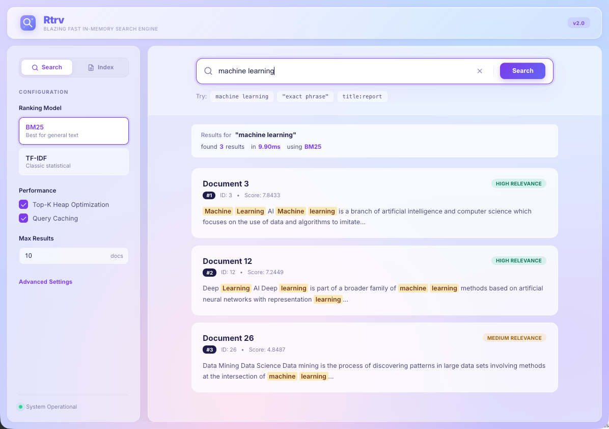
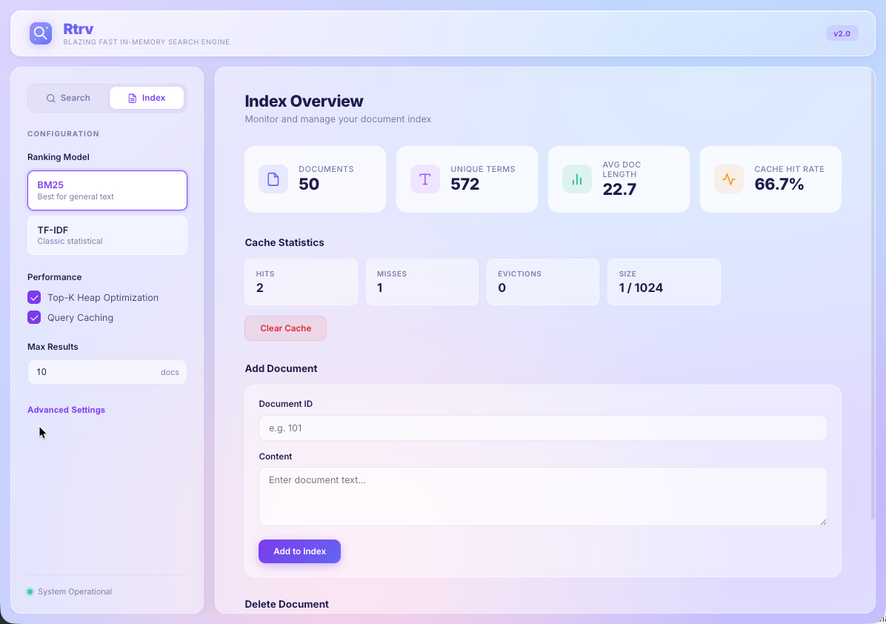

<h1 align="center">
  
  <span style="vertical-align: middle; font-size: 2.5em;">Rtrv</span>
</h1>

<p align="center">
  <strong>⚡ A blazing fast, in-memory full-text search engine written in modern C++17 ⚡</strong>
</p>

<p align="center">
  
  
  
  
</p>

<p align="center">
  
  &nbsp;
  
</p>

---

## Features

- **Sub-millisecond search** — inverted index with skip pointers and Top-K heap optimization
- **Multiple ranking algorithms** — BM25 (default), TF-IDF, ML-Ranker, plus a plugin architecture for custom rankers
- **SIMD-accelerated tokenization** — AVX2, SSE4.2, and ARM NEON with automatic detection
- **Fuzzy search** — Damerau-Levenshtein distance with bigram n-gram candidate filtering
- **Snippet extraction** — context-aware highlights with configurable tags
- **LRU query cache** — with TTL, thread-safe, per-request bypass
- **Advanced query syntax** — boolean operators, phrase queries, proximity, field-specific search
- **Binary persistence** — save and restore index snapshots
- **REST API** — async Drogon server with full CRUD, cache management, and skip pointer control
- **Glassmorphism Web UI** — search view, index management view, live stats dashboard
- **Comprehensive tests** — 11 GoogleTest suites covering every component
- **Benchmark suite** — 6 Google Benchmark suites with automated runner

## Quick Start

### Prerequisites

- C++17 compiler (GCC 9+, Clang 10+, MSVC 2019+)
- CMake 3.15+
- [Drogon](https://github.com/drogonframework/drogon) (optional, for the REST server)

```bash
# macOS
brew install cmake drogon

# Ubuntu/Debian
sudo apt install cmake libdrogon-dev libjsoncpp-dev
```

### Build

```bash
git clone https://github.com/your-username/rtrv.git
cd rtrv
mkdir build && cd build
cmake -DCMAKE_BUILD_TYPE=Release ..
make -j$(nproc)
```

### Run tests

```bash
ctest --output-on-failure
```

### Launch

```bash
# Start the server + open Web UI
./launch_webui.sh

# Or run manually
cd build/server
./rest_server_drogon 8080
# Open http://localhost:8080
```

## Usage

### As a library

```cpp
#include "search_engine.hpp"
using namespace rtrv_search_engine;

SearchEngine engine;

// Index documents (field-based storage)
Document doc;
doc.fields["title"] = "Machine Learning";
doc.fields["content"] = "ML is a branch of artificial intelligence";
engine.indexDocument(doc);

// Search
SearchOptions opts;
opts.max_results = 10;
opts.fuzzy_enabled = true;
opts.generate_snippets = true;

auto results = engine.search("machine learning", opts);
for (const auto& r : results) {
    std::cout << r.score << " " << r.document.getAllText() << "\n";
}

// Persistence
engine.saveSnapshot("index.bin");
engine.loadSnapshot("index.bin");
```

### Interactive CLI

```bash
cd build/server
./interactive_server
```

## Web UI

Rtrv ships with a glassmorphism-styled dashboard served directly by the Drogon server.

- **Search View** — real-time search with fuzzy matching and snippet highlighting
- **Index View** — live stats, cache monitoring, document CRUD

## API

All endpoints are served on a single port (default `8080`).

| Method | Endpoint | Description |
|--------|----------|-------------|
| `GET` | `/search?q=...` | Full-text search |
| `GET` | `/documents?offset=&limit=` | Browse documents |
| `GET` | `/stats` | Index statistics |
| `GET` | `/cache/stats` | Cache statistics |
| `DELETE` | `/cache` | Clear cache |
| `POST` | `/index` | Add document |
| `DELETE` | `/delete/{id}` | Remove document |
| `POST` | `/save` | Save snapshot |
| `POST` | `/load` | Load snapshot |
| `POST` | `/skip/rebuild` | Rebuild skip pointers |
| `GET` | `/skip/stats?term=` | Skip pointer stats |

Search supports `algorithm`, `max_results`, `use_top_k_heap`, `highlight`, `fuzzy`, `cache`, and more. See [server/README.md](server/README.md) for full parameter docs.

## Benchmarks

```bash
cd benchmarks && ./run_benchmarks.sh
```

| Operation | Throughput |
|-----------|------------|
| Index document | 200k–300k docs/sec |
| Simple search | 250k–300k queries/sec |
| BM25 ranking | ~100k queries/sec |
| Top-K (k=10, n=10K) | 120k–200k queries/sec |
| SIMD tokenization | 300–500 MB/s |

See [benchmarks/BENCHMARK_GUIDE.md](benchmarks/BENCHMARK_GUIDE.md) for detailed methodology and [benchmarks/EXAMPLE_RESULTS.md](benchmarks/EXAMPLE_RESULTS.md) for sample outputs.

## Project Structure

```
rtrv/
├── include/          # 13 public headers
├── src/              # 11 implementation files
├── tests/            # 11 GoogleTest suites
├── benchmarks/       # 6 Google Benchmark suites + scripts
├── server/           # Drogon REST server + Interactive CLI
│   └── ui/           # Glassmorphism Web UI
├── examples/         # simple_search, batch_indexing, skip_pointer_demo
├── data/             # stopwords.txt, wikipedia_sample.json
└── launch_webui.sh   # One-command launcher
```

## Documentation

- [TECHNICAL_DESIGN.md](TECHNICAL_DESIGN.md) — Architecture, component deep-dives, API reference
- [server/README.md](server/README.md) — REST API docs, endpoint reference, server setup
- [benchmarks/BENCHMARK_GUIDE.md](benchmarks/BENCHMARK_GUIDE.md) — Benchmarking guide
- [examples/README.md](examples/README.md) — Usage examples

## Contributing

Contributions are welcome! Please open an issue or submit a pull request.

1. Fork the repository
2. Create your branch (`git checkout -b feature/my-feature`)
3. Commit your changes (`git commit -am 'Add my feature'`)
4. Push to the branch (`git push origin feature/my-feature`)
5. Open a Pull Request

## License

This project is licensed under the MIT License — see the [LICENSE](LICENSE) file for details.

---

<p align="center">Built with C++17 · <a href="https://github.com/drogonframework/drogon">Drogon</a> · <a href="https://github.com/google/googletest">GoogleTest</a> · <a href="https://github.com/google/benchmark">Google Benchmark</a> · <a href="https://github.com/nlohmann/json">nlohmann/json</a></p>
