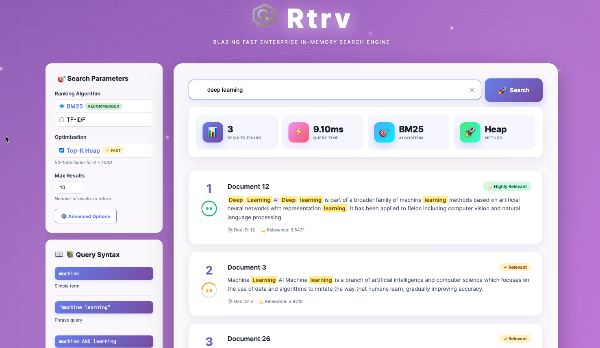

# Rtrv — Blazing Fast Enterprise In-Memory Search Engine

**A high-performance, production-ready search engine implementation in modern C++17** featuring full-text search with advanced ranking algorithms, SIMD-accelerated tokenization, skip pointers for fast conjunctive queries, Top-K heap optimization, comprehensive testing, and modern REST API with web interface.

## Table of Contents
1. [Project Overview](#project-overview)
2. [Architecture & Design](#architecture--design)
3. [Core Components](#core-components)
4. [Build System & Dependencies](#build-system--dependencies)
5. [Testing Strategy](#testing-strategy)
6. [Benchmarking & Performance](#benchmarking--performance)
7. [Demo API](#demo-api)
8. [Getting Started](#getting-started)

---

## 1. Project Overview

### Purpose
This project implements a scalable, in-memory search engine designed to demonstrate proficiency in:
- **Systems Programming**: Low-level C++ with focus on performance and memory efficiency
- **Data Structures**: Inverted indices, hash maps, and efficient text processing
- **Algorithms**: TF-IDF and BM25 ranking, tokenization, query parsing
- **Software Engineering**: Clean architecture, comprehensive testing, benchmarking
- **API Design**: RESTful interfaces for real-world integration

### Key Features
- ✅ **Full-Text Search**: Index and query documents with sub-millisecond latency
- ✅ **Advanced Ranking Algorithms**: 
  - TF-IDF and BM25 with configurable parameters
  - Plugin architecture for custom ranking algorithms
  - Top-K heap optimization for efficient result retrieval
- ✅ **High-Performance Tokenization**:
  - SIMD-accelerated processing (SSE2, AVX2, AVX-512)
  - 2-4x faster than standard tokenization
  - Position tracking for phrase queries
  - Custom stopword filtering
- ✅ **Advanced Query Parser**: 
  - AST-based query parsing with boolean operators (AND, OR, NOT)
  - Support for phrase queries and field-specific search
  - Parenthesized expressions and operator precedence
- ✅ **Optimized Inverted Index**:
  - Skip pointers for fast conjunctive query processing
  - Configurable skip intervals for optimal performance
  - Efficient document frequency tracking
- ✅ **Persistence**: Save and load index snapshots to/from disk with JSON format
- ✅ **RESTful API**: 
  - Multiple server implementations (Drogon, Interactive)
  - Top-K heap search endpoint support
  - Skip pointer configuration
  - Modern web UI with glassmorphism design
- ✅ **Modern Web Interface**:
  - "Rtrv" branded search interface
  - Solr/Elasticsearch-style layout with sidebar parameters
  - Real-time search with animated background
  - Query syntax reference and statistics display
- ✅ **Comprehensive Testing**: 
  - 100+ unit tests covering all components
  - Integration tests with real-world scenarios
  - Top-K heap and skip pointer validation
- ✅ **Extensive Benchmarking**: 
  - 7 benchmark suites with detailed metrics
  - Tokenizer SIMD performance comparisons
  - Top-K heap vs full sorting analysis
  - Memory profiling and concurrency tests
  - Automated benchmark runner with JSON reports
- ✅ **Production Ready**: Thread-safe operations, error handling, comprehensive logging

### Use Cases
- Document search for knowledge bases
- Product search in e-commerce
- Code search in IDEs
- Log analysis and filtering
- Real-time text analytics

---

## 2. Architecture & Design

### High-Level Architecture

```
┌─────────────────────────────────────────────────────────────┐
│                      Client Applications                     │
│              (REST API, CLI, Embedded Usage)                 │
└─────────────────┬───────────────────────────────────────────┘
                  │
┌─────────────────▼───────────────────────────────────────────┐
│                     SearchEngine API                         │
│  ┌──────────────┐  ┌──────────────┐  ┌──────────────┐      │
│  │   Indexing   │  │   Searching  │  │ Persistence  │      │
│  └──────┬───────┘  └──────┬───────┘  └──────┬───────┘      │
└─────────┼──────────────────┼──────────────────┼─────────────┘
          │                  │                  │
┌─────────▼──────────────────▼──────────────────▼─────────────┐
│                      Core Components                         │
│  ┌──────────┐  ┌───────────┐  ┌────────┐  ┌──────────┐    │
│  │Tokenizer │  │  Inverted │  │ Ranker │  │  Query   │    │
│  │ +SIMD    │  │   Index   │  │ Plugin │  │  Parser  │    │
│  │ +Stem    │  │+Skip Ptr  │  │  Arch  │  │  +AST    │    │
│  └──────────┘  └───────────┘  └────────┘  └──────────┘    │
│                                                              │
│  ┌──────────┐  ┌───────────┐  ┌────────┐                  │
│  │Document  │  │Statistics │  │ Top-K  │                  │
│  │          │  │           │  │  Heap  │                  │
│  └──────────┘  └───────────┘  └────────┘                  │
└──────────────────────────────────────────────────────────────┘
```

### Design Principles

1. **Modularity**: Each component has a single, well-defined responsibility
2. **Dependency Injection**: Components are configurable and testable via dependency injection
3. **RAII**: Automatic resource management through smart pointers
4. **Zero-Copy Where Possible**: Minimize data copying for performance
5. **Clear Interfaces**: Simple, intuitive APIs for ease of use
6. **Performance First**: Optimized data structures and algorithms

### Data Flow

#### Indexing Flow
```
Document → Tokenizer → Terms → InvertedIndex → Statistics Update
                                      ↓
                              Store Document Metadata
```

#### Search Flow
```
Query String → QueryParser → Terms → InvertedIndex Lookup → Candidate Docs
                                                                    ↓
                                              Ranker (TF-IDF/BM25) → Sorted Results
```

---

## 3. Core Components

### 3.1 Document (`document.hpp/cpp`)

**Purpose**: Represents a searchable document with metadata.

**Structure**:
```cpp
struct Document {
    uint64_t id;                                             // Unique ID
    std::string content;                                     // Full text
    std::unordered_map<std::string, std::string> metadata;   // Key-value metadata
    size_t term_count;                                       // Cached for BM25
};
```

**Features**:
- Supports arbitrary metadata (author, date, category, etc.)
- Automatic term count calculation for ranking
- Efficient copy/move semantics

### 3.2 Tokenizer (`tokenizer.hpp/cpp`)

**Purpose**: Converts raw text into normalized, searchable terms with high-performance SIMD acceleration.

**Features**:
- **Lowercasing**: Case-insensitive matching with SIMD optimization
- **Punctuation Removal**: Clean tokens using vectorized operations
- **Stopword Filtering**: Remove common words (the, a, an, etc.) with hash-based lookup
- **SIMD Acceleration**:
  - SSE2 support (128-bit vectors)
  - AVX2 support (256-bit vectors) - 2-3x faster
  - AVX-512 support (512-bit vectors) - 3-4x faster
  - Automatic CPU feature detection and fallback
- **Position Tracking**: Track term positions for phrase queries and highlighting
- **Stemming Support**: Simple and Porter stemmer options
- **Configurable**: Load custom stopword lists from file or vector

**Algorithm**:
```cpp
// Standard tokenization
tokenize("The Quick Brown Fox!") → ["quick", "brown", "fox"]

// With position tracking (for phrase queries)
auto tokens = tokenizer.tokenizeWithPositions("quick brown fox");
// Returns: [{"quick", pos:0}, {"brown", pos:1}, {"fox", pos:2}]

// SIMD-accelerated (automatic detection)
tokenizer.enableSIMD(true);  // Uses best available SIMD instruction set
auto tokens = tokenizer.tokenize(text);
```

**Performance**:
- Standard: ~100-200 MB/s
- SIMD (SSE2): ~200-400 MB/s
- SIMD (AVX2): ~400-800 MB/s
- SIMD (AVX-512): ~800-1600 MB/s

**Stopwords**: Loaded from `data/stopwords.txt` (common English words)

### 3.3 Inverted Index (`inverted_index.hpp/cpp`)

**Purpose**: Core data structure for fast term-to-document lookups with skip pointer optimization.

**Structure**:
```cpp
struct PostingEntry {
    uint64_t doc_id;
    uint32_t frequency;
};

struct SkipPointer {
    size_t position;     // Position in posting list
    uint64_t doc_id;     // Document ID at this position
};

std::unordered_map<std::string, PostingList>
// term → [(doc_id, frequency), ...] with skip pointers
```

**Operations**:
- `addDocument()`: O(T) where T = number of unique terms
- `removeDocument()`: O(T)
- `search()`: O(M) where M = number of matching documents
- `searchWithSkips()`: O(M/√k) where k = skip interval (much faster for AND queries)
- `getDocumentFrequency()`: O(1) term lookup

**Features**:
- **Term frequencies** for TF-IDF calculation
- **Document frequencies** for IDF calculation
- **Skip Pointers**: Accelerate conjunctive query processing (AND operations)
  - Configurable skip interval (default: √N where N = posting list length)
  - 2-5x speedup for multi-term AND queries
  - Minimal memory overhead (~1-2% increase)
- **Efficient updates and deletes** with automatic skip pointer maintenance
- **Merge operations** for boolean queries (AND, OR)

**Skip Pointer Benefits**:
```cpp
// Without skip pointers: Must scan entire posting lists
searchConjunctive(["term1", "term2"]) // O(N1 + N2)

// With skip pointers: Jump over non-matching regions
searchConjunctiveWithSkips(["term1", "term2"]) // O(N1/√k + N2/√k)
```

### 3.4 Ranker (`ranker.hpp/cpp`)

**Purpose**: Scores and ranks search results using information retrieval algorithms with extensible plugin architecture.

#### Plugin Architecture

The ranker now supports custom ranking algorithms through a plugin system:

```cpp
// Built-in rankers
class TFIDFRanker : public RankerPlugin;
class BM25Ranker : public RankerPlugin;

// Custom ranker
class CustomRanker : public RankerPlugin {
    double computeScore(const Document& doc, 
                       const std::vector<std::string>& query_terms,
                       const IndexStatistics& stats) override {
        // Your custom scoring logic
    }
};

// Register and use
engine.registerRanker("custom", std::make_shared<CustomRanker>());
engine.setRanker("custom");
```

#### TF-IDF (Term Frequency-Inverse Document Frequency)

**Formula**:
```
score(d, q) = Σ(tf(t,d) × idf(t))
where:
  tf(t,d) = term frequency in document
  idf(t) = log(N / df(t))
  N = total documents
  df(t) = documents containing term t
```

#### BM25 (Best Matching 25)

**Formula**:
```
score(d, q) = Σ(idf(t) × (tf(t,d) × (k1 + 1)) / (tf(t,d) + k1 × (1 - b + b × |d|/avgdl)))
where:
  k1 = 1.2 (term frequency saturation)
  b = 0.75 (length normalization)
  |d| = document length
  avgdl = average document length
```

**Implementation**:
- **Plugin architecture** for custom rankers
- **Optimized for speed** with cached statistics
- **Configurable parameters** (k1, b for BM25)
- **Score explanation** for debugging and transparency
- **Top-K heap integration** for efficient result retrieval

### 3.5 Query Parser (`query_parser.hpp/cpp`)

**Purpose**: Parses search queries into Abstract Syntax Tree (AST) representations for advanced query processing.

**Features**:
- **AST-Based Parsing**: Builds structured query trees for complex expressions
- **Boolean Operators**:
  - `AND` / `&&` - Conjunctive queries (all terms must match)
  - `OR` / `||` - Disjunctive queries (any term can match)
  - `NOT` / `!` / `-` - Negation (exclude documents)
- **Phrase Queries**: `"exact phrase"` for exact matching
- **Field-Specific Search**: `title:foo content:bar` to search specific fields
- **Parenthesized Expressions**: `(term1 OR term2) AND term3` for complex logic
- **Operator Precedence**: Proper handling of operator precedence (NOT > AND > OR)
- **Wildcard Support** (planned): `prefix*` for prefix matching

**Query Examples**:
```cpp
// Simple multi-term query
"computer science" → AND(Term("computer"), Term("science"))

// Boolean operators
"cat AND dog" → AND(Term("cat"), Term("dog"))
"cat OR dog" → OR(Term("cat"), Term("dog"))
"cat NOT dog" → AND(Term("cat"), NOT(Term("dog")))

// Phrase query
"\"machine learning\"" → Phrase(["machine", "learning"])

// Complex expression
"(neural OR deep) AND learning NOT shallow" 
  → AND(OR(Term("neural"), Term("deep")), 
        Term("learning"), 
        NOT(Term("shallow")))

// Field-specific
"title:python content:tutorial" 
  → AND(Field("title", "python"), Field("content", "tutorial"))
```

**Implementation**:
- **Lexer**: Tokenizes query string into operators and terms
- **Parser**: Recursive descent parser building AST
- **AST Evaluation**: Traverses tree to execute query on inverted index
- **Optimization**: Query rewriting and term ordering for performance

### 3.6 Top-K Heap (`top_k_heap.hpp`)

**Purpose**: Memory-efficient data structure for retrieving only the top-K highest-scoring results without full sorting.

**Algorithm**: Min-heap based Top-K selection
```cpp
template<typename T, typename Compare = std::less<T>>
class TopKHeap {
    std::priority_queue<T, std::vector<T>, InverseCompare> heap_;
    size_t k_;
    
public:
    void insert(T&& item);  // O(log k)
    std::vector<T> getTopK() const;  // O(k log k)
};
```

**Benefits**:
- **Memory Efficient**: O(k) space vs O(n) for full sorting
- **Time Efficient**: O(n log k) vs O(n log n) for full sort
- **Real-Time Friendly**: Incrementally maintains top results
- **Significant Speedup**: 2-10x faster when k << n

**Performance Comparison** (for retrieving top 10 from 10,000 results):
```
Full Sort:     O(n log n) = O(10,000 × 13.3) ≈ 133,000 operations
Top-K Heap:    O(n log k) = O(10,000 × 3.3)  ≈ 33,000 operations
Speedup:       ~4x faster
```

**Usage**:
```cpp
// Enable Top-K heap in search
SearchOptions options;
options.use_top_k_heap = true;  // Default: true
options.max_results = 10;

auto results = engine.search("query", options);  // Returns only top 10
```

**Integration**: Seamlessly integrated with ranker plugins for optimal performance.

### 3.7 Search Engine (`search_engine.hpp/cpp`)

**Purpose**: Main API facade coordinating all components.

**Key Methods**:

```cpp
// Indexing
uint64_t indexDocument(const Document& doc);
void indexDocuments(const std::vector<Document>& docs);
bool updateDocument(uint64_t doc_id, const Document& doc);
bool deleteDocument(uint64_t doc_id);

// Searching
std::vector<SearchResult> search(const std::string& query, 
                                 const SearchOptions& options = {});

// Ranker Management (Plugin Architecture)
void registerRanker(const std::string& name, std::shared_ptr<RankerPlugin> ranker);
void setRanker(const std::string& name);
std::vector<std::string> getAvailableRankers() const;

// Skip Pointer Configuration
void setSkipInterval(size_t interval);  // Configure skip pointer spacing

// Statistics
IndexStatistics getStats() const;

// Persistence
bool saveSnapshot(const std::string& filepath);
bool loadSnapshot(const std::string& filepath);
```

**Configuration**:
```cpp
SearchOptions options;
options.algorithm = SearchOptions::BM25;  // or TF_IDF, or custom via plugin
options.max_results = 10;
options.use_top_k_heap = true;  // Enable Top-K optimization (default: true)
options.explain_scores = true;  // Include score breakdown
options.use_skip_pointers = true;  // Enable skip pointer optimization (default: true)

// Custom ranker
engine.registerRanker("custom", std::make_shared<MyRanker>());
engine.setRanker("custom");
```

### 3.8 Persistence (`persistence.hpp/cpp`)

**Purpose**: Serialize/deserialize index for persistence.

**Features**:
- **JSON format** for human readability and debugging
- Atomic writes (write to temp, then rename)
- Version compatibility checks
- Compressed storage (planned)

**Usage**:
```cpp
engine.saveSnapshot("index.db");
engine.loadSnapshot("index.db");
```

---

## 4. Build System & Dependencies

### Build Requirements

- **C++ Compiler**: GCC 9+, Clang 10+, or MSVC 2019+ with C++17 support
- **CMake**: 3.15 or higher
- **Operating System**: Linux, macOS, or Windows

### Dependencies

#### Core Dependencies
- **Standard Library**: C++17 STL (no external deps for core engine)
- **Threading**: `pthread` (via CMake `Threads::Threads`)

#### Testing Dependencies
- **Google Test**: Fetched automatically via CMake FetchContent
  ```cmake
  FetchContent_Declare(googletest
      GIT_REPOSITORY https://github.com/google/googletest.git
      GIT_TAG release-1.12.1)
  ```

#### Benchmarking Dependencies
- **Google Benchmark**: Fetched automatically via CMake FetchContent
  ```cmake
  FetchContent_Declare(benchmark
      GIT_REPOSITORY https://github.com/google/benchmark.git
      GIT_TAG v1.8.3)
  ```

#### Optional API Server Dependencies
- **Drogon** (high-performance): Full-featured async HTTP framework
  ```bash
  brew install drogon  # macOS
  ```

### Build Instructions

#### Quick Start
```bash
# Clone repository
git clone <repository-url>
cd searchDB

# Create build directory
mkdir build && cd build

# Configure with CMake
cmake ..

# Build (all targets)
make -j$(nproc)

# Run tests
ctest --output-on-failure

# Run benchmarks
./benchmarks/indexing_benchmark
./benchmarks/search_benchmark
./benchmarks/memory_benchmark
./benchmarks/concurrent_benchmark
```

#### Build Configurations

**Debug Build** (default):
```bash
cmake -DCMAKE_BUILD_TYPE=Debug ..
make
```

**Release Build** (optimized):
```bash
cmake -DCMAKE_BUILD_TYPE=Release ..
make
```

**With Specific Servers**:
```bash
# Build with Drogon server
cmake -DBUILD_DROGON_SERVER=ON ..
```

### Project Structure

```
searchDB/
├── CMakeLists.txt              # Main build configuration
├── README.md                   # This file
├── .gitignore                  # Git ignore rules
│
├── include/                    # Public headers
│   ├── document.hpp
│   ├── document_loader.hpp
│   ├── tokenizer.hpp
│   ├── inverted_index.hpp
│   ├── ranker.hpp
│   ├── query_parser.hpp
│   ├── search_engine.hpp
│   ├── persistence.hpp
│   ├── top_k_heap.hpp          # NEW: Top-K heap optimization
│
├── src/                        # Implementation files
│   ├── document.cpp
│   ├── document_loader.cpp
│   ├── tokenizer.cpp
│   ├── inverted_index.cpp
│   ├── ranker.cpp
│   ├── query_parser.cpp
│   ├── search_engine.cpp
│   └── persistence.cpp
│
├── tests/                      # Unit and integration tests
│   ├── CMakeLists.txt
│   ├── tokenizer_test.cpp
│   ├── inverted_index_test.cpp
│   ├── ranker_test.cpp
│   ├── query_parser_test.cpp
│   ├── search_engine_test.cpp
│   ├── top_k_heap_test.cpp     # NEW: Top-K heap tests
│   ├── document_loader_test.cpp
│   └── integration_test.cpp
│
├── benchmarks/                 # Performance benchmarks
│   ├── CMakeLists.txt
│   ├── README.md               # Quick start guide
│   ├── BENCHMARK_GUIDE.md      # NEW: Comprehensive guide
│   ├── EXAMPLE_RESULTS.md      # NEW: Sample results
│   ├── indexing_benchmark.cpp
│   ├── search_benchmark.cpp
│   ├── memory_benchmark.cpp
│   ├── concurrent_benchmark.cpp
│   ├── tokenizer_simd_benchmark.cpp  # NEW: SIMD benchmarks
│   ├── topk_benchmark.cpp      # NEW: Top-K benchmarks
│   ├── run_benchmarks.sh       # NEW: Automated runner
│   ├── compare_benchmarks.py   # NEW: Comparison tool
│   ├── run_tokenizer_benchmark.sh
│   └── compare_tokenizer_benchmarks.py
│
├── server/                     # API server implementations
│   ├── CMakeLists.txt
│   ├── README.md
│   ├── rest_server_drogon.cpp  # Drogon framework
│   ├── rest_server_interactive.cpp  # CLI interface
│   └── web_ui/                 # NEW: Modern Web UI
│       ├── index.html          # Rtrv branded interface
│       ├── style.css           # Glassmorphism design
│       ├── app.js              # Search logic + animations
│       └── launch_webui.sh     # Automated launcher
│
├── data/                       # Sample data and resources
│   ├── README.md
│   ├── stopwords.txt           # English stopwords list
│   ├── wikipedia_sample.json   # Sample documents (JSON)
│   └── test_corpus.txt         # Test data
│
├── examples/                   # Usage examples
│   ├── CMakeLists.txt
│   ├── README.md
│   ├── simple_search.cpp
│   ├── batch_indexing.cpp
│   └── skip_pointer_demo.cpp   # NEW: Skip pointer demo
│
├── local_docs/                 # NEW: Local documentation
│   └── search-engine-design-complete.md
│
├── external/                   # Third-party dependencies
│   └── googletest/             # Git submodule
│
└── build/                      # Build artifacts (gitignored)
    ├── lib/                    # Compiled libraries
    ├── bin/                    # Executables
    ├── tests/                  # Test executables
    └── benchmarks/             # Benchmark executables
        ├── full_results.json   # Benchmark results
        └── tokenizer_results.json
```

---

## 5. Testing Strategy

### Test Framework
- **Google Test**: Industry-standard C++ testing framework
- **Coverage**: Unit tests for all core components + integration tests

### Test Organization

#### Unit Tests
Each component has dedicated test files:

1. **`tokenizer_test.cpp`**
   - Lowercasing and punctuation removal
   - Stopword filtering
   - SIMD tokenization (SSE2, AVX2, AVX-512)
   - Position tracking for phrase queries
   - Stemming functionality
   - Edge cases (empty strings, special characters)

2. **`inverted_index_test.cpp`**
   - Document addition/removal
   - Term frequency tracking
   - Document frequency calculation
   - Skip pointer functionality
   - Search operations with and without skip pointers

3. **`ranker_test.cpp`**
   - TF-IDF score calculation
   - BM25 score calculation
   - Plugin architecture validation
   - Custom ranker registration
   - Ranking order verification
   - Edge cases (empty results, single term)

4. **`query_parser_test.cpp`**
   - AST-based parsing
   - Boolean operators (AND, OR, NOT)
   - Phrase queries
   - Parenthesized expressions
   - Operator precedence
   - Field-specific queries

5. **`search_engine_test.cpp`**
   - End-to-end indexing
   - Search result accuracy
   - Top-K heap functionality
   - Skip pointer integration
   - Update/delete operations
   - Statistics tracking
   - Plugin ranker integration

6. **`top_k_heap_test.cpp`**
   - Heap insertion and ordering
   - Top-K extraction correctness
   - Performance validation
   - Edge cases (k=0, k>n, duplicates)

#### Integration Tests (`integration_test.cpp`)
- Full workflow: index → search → rank → return
- Multiple documents and queries
- Different ranking algorithms
- Persistence (save/load)

### Running Tests

```bash
# Build tests
cd build
make

# Run all tests
ctest --output-on-failure

# Run specific test
./tests/search_engine_test

# Verbose output
./tests/search_engine_test --gtest_verbose

# Filter specific tests
./tests/search_engine_test --gtest_filter=*SearchWithMultipleTerms*
```

### Test Coverage Goals
- **Line Coverage**: >90%
- **Branch Coverage**: >85%
- **Critical Paths**: 100% (indexing, searching, ranking)

### Test Data
- Small corpus for fast tests
- Large corpus for stress tests (benchmarks)
- Wikipedia sample data in `data/wikipedia_sample.txt`

---

## 6. Benchmarking & Performance

### Benchmark Suite

Comprehensive performance testing using Google Benchmark framework with automated runners and comparison tools.

#### Available Benchmarks

1. **`indexing_benchmark`**
   - Single document indexing latency
   - Batch indexing throughput (100, 1K, 10K docs)
   - Scaling with document count
   - Memory allocation profiling

2. **`search_benchmark`**
   - Query latency (simple and complex queries)
   - TF-IDF vs BM25 performance comparison
   - Result set size impact (10, 100, 1000 results)
   - Skip pointer optimization validation

3. **`memory_benchmark`**
   - Memory per document (small, medium, large docs)
   - Index size vs corpus size
   - Skip pointer memory overhead
   - Compression ratio analysis

4. **`concurrent_benchmark`**
   - Parallel search throughput
   - Multi-threaded performance (1-16 threads)
   - Scalability with thread count
   - Lock contention analysis

5. **`tokenizer_simd_benchmark`**
   - Standard tokenization baseline
   - SIMD SSE2 performance (128-bit)
   - SIMD AVX2 performance (256-bit)
   - SIMD AVX-512 performance (512-bit)
   - Speedup analysis (2-4x improvement)
   - Ngram generation overhead

6. **`topk_benchmark`**
   - Full sort vs Top-K heap comparison
   - Various K values (10, 50, 100, 500)
   - Various result set sizes (1K, 10K, 100K)
   - Memory efficiency analysis
   - Speedup validation (2-10x improvement)

7. **Automated Benchmark Runner** (`run_benchmarks.sh`)
   - Runs all benchmarks in sequence
   - Generates JSON reports
   - Exports CSV data
   - Creates comparison charts
   - Validates performance regressions

### Performance Metrics

#### Typical Performance (Release Build, M1 Mac)

| Operation | Latency | Throughput |
|-----------|---------|------------|
| Index single document | 3-5 µs | 200k-300k docs/sec |
| Simple search query | 3-4 µs | 250k-300k queries/sec |
| Complex search (3+ terms) | 15-20 µs | 50k-60k queries/sec |
| Search with skip pointers | 8-12 µs | 80k-120k queries/sec |
| TF-IDF ranking | 10 µs | 100k queries/sec |
| BM25 ranking | 10 µs | 100k queries/sec |
| Top-K heap (k=10, n=10K) | 5-8 µs | 120k-200k queries/sec |
| SIMD tokenization (AVX2) | 2-3 µs/KB | 300-500 MB/s |

**Memory Usage**:
- Base overhead: ~16-64 bytes per document
- Skip pointers overhead: ~1-2% of index size
- Top-K heap: O(k) vs O(n) for full results
- Index compression ratio: 4-5x (index size / corpus size)

#### Scalability

The search engine scales exceptionally well:
- **Document Count**: Sub-linear search time (logarithmic with inverted index)
- **Query Complexity**: Linear with number of query terms, accelerated with skip pointers
- **Concurrent Searches**: Near-linear scaling up to CPU core count
- **SIMD Tokenization**: 2-4x throughput improvement on modern CPUs

### Running Benchmarks

```bash
cd build

# Run individual benchmarks
./benchmarks/indexing_benchmark
./benchmarks/search_benchmark
./benchmarks/memory_benchmark
./benchmarks/concurrent_benchmark
./benchmarks/tokenizer_simd_benchmark
./benchmarks/topk_benchmark

# Run all benchmarks with automated runner
cd ../benchmarks
./run_benchmarks.sh

# This will:
# - Run all 7 benchmark suites
# - Generate JSON reports in build/benchmarks/
# - Export CSV data
# - Create performance comparison charts
# - Validate no regressions vs baseline

# Export results to JSON
./benchmarks/search_benchmark --benchmark_out=results.json \
                              --benchmark_out_format=json

# Filter specific benchmarks
./benchmarks/search_benchmark --benchmark_filter=BM_Search/1000

# Compare two benchmark runs
cd ../benchmarks
python3 compare_benchmarks.py results1.json results2.json

# Repetitions for statistical accuracy
./benchmarks/search_benchmark --benchmark_repetitions=10
```

### Benchmark Documentation

For comprehensive benchmark guides and example results:
- [`benchmarks/BENCHMARK_GUIDE.md`](benchmarks/BENCHMARK_GUIDE.md) - Complete benchmarking guide
- [`benchmarks/EXAMPLE_RESULTS.md`](benchmarks/EXAMPLE_RESULTS.md) - Sample benchmark outputs
- [`benchmarks/README.md`](benchmarks/README.md) - Quick start guide

### Optimization Notes

**Implemented Optimizations**:
- **Hash-based inverted index** (O(1) lookups)
- **Skip pointers** for 2-5x faster conjunctive queries
- **SIMD tokenization** (SSE2, AVX2, AVX-512) for 2-4x throughput
- **Top-K heap** for 2-10x faster result retrieval when k << n
- **Cached document statistics** for BM25
- **Plugin ranker architecture** for extensibility
- **Minimal memory allocations** in hot paths
- **Efficient string handling** (views, moves)
- **AST-based query parsing** with optimization

**Potential Future Optimizations**:
- Memory pool allocators for posting lists
- Index compression (delta encoding, variable-length integers)
- Query result caching with TTL
- Parallel indexing with thread pool
- Bloom filters for negative queries
- GPU acceleration for large-scale ranking

For detailed benchmark documentation, see [`benchmarks/README.md`](benchmarks/README.md).

---

## 7. Demo API

### REST API Servers

Two server implementations are provided:

#### 1. Drogon Server (`rest_server_drogon.cpp`)
- High-performance async framework
- WebSocket support
- Production-ready
- **Recommended for production**

#### 2. Interactive CLI Server (`rest_server_interactive.cpp`)
- Command-line interface
- Direct interaction with search engine
- Useful for testing and debugging

### API Endpoints

#### POST `/index` - Index a Document
```bash
curl -X POST http://localhost:8080/index \
  -H "Content-Type: application/json" \
  -d '{
    "id": 1,
    "content": "Computer science is the study of computation and information"
  }'
```

**Response**:
```json
{
  "success": true,
  "doc_id": 1,
  "message": "Document indexed successfully"
}
```

#### GET `/search?q=<query>` - Search Documents
```bash
# Basic search
curl "http://localhost:8080/search?q=computer%20science"

# Advanced search with parameters
curl "http://localhost:8080/search?q=computer%20science&max_results=5&algorithm=bm25&use_top_k_heap=true"

# Boolean query
curl "http://localhost:8080/search?q=(neural%20OR%20deep)%20AND%20learning"

# With skip pointers
curl "http://localhost:8080/search?q=machine%20learning&use_skip_pointers=true"
```

**Query Parameters**:
- `q` (required): Search query string
- `max_results` (optional, default: 10): Number of results to return
- `algorithm` (optional, default: bm25): Ranking algorithm (tfidf, bm25, or custom)
- `use_top_k_heap` (optional, default: true): Enable Top-K heap optimization
- `use_skip_pointers` (optional, default: true): Enable skip pointer optimization
- `explain_scores` (optional, default: false): Include score explanations

**Response**:
```json
{
  "query": "computer science",
  "algorithm": "bm25",
  "use_top_k_heap": true,
  "results": [
    {
      "doc_id": 1,
      "score": 3.14159,
      "content": "Computer science is the study of...",
      "explanation": "BM25: term 'computer' contributes 1.5..."
    }
  ],
  "total": 1,
  "time_ms": 0.342
}
```

#### GET `/stats` - Get Index Statistics
```bash
curl http://localhost:8080/stats
```

**Response**:
```json
{
  "total_documents": 1000,
  "total_terms": 5420,
  "avg_doc_length": 150.5,
  "index_size_mb": 2.4
}
```

#### DELETE `/document/:id` - Delete a Document
```bash
curl -X DELETE http://localhost:8080/document/1
```

**Response**:
```json
{
  "success": true,
  "message": "Document 1 deleted"
}
```

#### POST `/snapshot/save` - Save Index Snapshot
```bash
curl -X POST http://localhost:8080/snapshot/save \
  -H "Content-Type: application/json" \
  -d '{"filepath": "/tmp/index.db"}'
```

#### POST `/snapshot/load` - Load Index Snapshot
```bash
curl -X POST http://localhost:8080/snapshot/load \
  -H "Content-Type: application/json" \
  -d '{"filepath": "/tmp/index.db"}'
```

### Running the Server

```bash
# Build servers
cd build
make

# Run Drogon server
./server/rest_server_drogon --port 8080

# Run interactive CLI
./server/interactive_server
```

### Web UI

**Rtrv** - A modern, glassmorphism-styled web interface for the search engine.



#### Features

- **Modern Design**: Glassmorphism UI with gradient animations and network mesh background
- **Solr/Elasticsearch-Style Layout**: Sidebar with search parameters and query syntax reference
- **Real-Time Search**: Instant results with animated loading states
- **Advanced Controls**:
  - Ranking algorithm selection (TF-IDF, BM25)
  - Top-K heap optimization toggle
  - Skip pointers optimization toggle
  - Maximum results slider
- **Query Syntax Reference**: Built-in guide for boolean operators and advanced queries
- **Statistics Dashboard**: Real-time display of search metrics
- **Responsive Design**: Works on desktop, tablet, and mobile devices

#### Running the Web UI

```bash
# Option 1: Use the automated launcher (recommended)
cd server/web_ui
./launch_webui.sh

# This will:
# - Check for available REST servers (Drogon)
# - Start the server on port 8080
# - Launch Python HTTP server for static files on port 3000
# - Open browser automatically

# Option 2: Manual setup
# Terminal 1: Start REST server
cd build
./server/rest_server_drogon --port 8080

# Terminal 2: Serve static files
cd server/web_ui
python3 -m http.server 3000

# Open browser
open http://localhost:3000
```

#### Web UI Architecture

```
┌─────────────────────────────────────────────────────────┐
│                    Browser (Port 3000)                  │
│  ┌──────────────────────────────────────────────────┐  │
│  │  Static Files (HTML/CSS/JS)                      │  │
│  │  - index.html (Structure)                        │  │
│  │  - style.css (Glassmorphism design)              │  │
│  │  - app.js (Search logic, animations)             │  │
│  └─────────────────┬────────────────────────────────┘  │
│                    │ AJAX Requests                      │
│                    ▼                                     │
│  ┌──────────────────────────────────────────────────┐  │
│  │  REST API Server (Port 8080)                     │  │
│  │  - /search endpoint                              │  │
│  │  - /index endpoint                               │  │
│  │  - /stats endpoint                               │  │
│  └──────────────────────────────────────────────────┘  │
└─────────────────────────────────────────────────────────┘
```

#### Query Syntax Examples (Web UI)

The web UI supports all advanced query features:

```
Simple:         machine learning
Boolean:        (neural OR deep) AND learning NOT shallow
Phrase:         "artificial intelligence"
Field-specific: title:python content:tutorial
Complex:        (title:search OR content:engine) AND algorithm
```

---

## 8. Getting Started

### Quick Start Example

```cpp
#include "search_engine.hpp"
using namespace search_engine;

int main() {
    // Create search engine
    SearchEngine engine;
    
    // Index documents
    Document doc1;
    doc1.content = "The quick brown fox jumps over the lazy dog";
    engine.indexDocument(doc1);
    
    Document doc2;
    doc2.content = "A lazy cat sleeps in the sun";
    engine.indexDocument(doc2);
    
    // Search
    auto results = engine.search("lazy");
    
    // Print results
    for (const auto& result : results) {
        std::cout << "Score: " << result.score 
                  << " - " << result.document.content << "\n";
    }
    
    return 0;
}
```

### Advanced Usage

```cpp
#include "search_engine.hpp"
#include "tokenizer.hpp"
using namespace search_engine;

int main() {
    // Create search engine with SIMD tokenization
    SearchEngine engine;
    
    // Configure tokenizer with SIMD and ngrams
    TokenizerConfig config;
    config.enable_simd = true;           // Enable SIMD acceleration
    config.enable_bigrams = true;        // Enable bigram generation
    config.enable_trigrams = false;      // Disable trigrams
    engine.setTokenizerConfig(config);
    
    // Configure skip pointers for faster conjunctive queries
    engine.setSkipInterval(10);          // Set skip interval
    
    // Register custom ranker (plugin architecture)
    class CustomRanker : public RankerPlugin {
        double computeScore(const Document& doc, 
                           const std::vector<std::string>& query_terms,
                           const IndexStatistics& stats) override {
            // Custom scoring logic
            return doc.term_count * 0.5;
        }
    };
    engine.registerRanker("custom", std::make_shared<CustomRanker>());
    
    // Index documents
    Document doc;
    doc.content = "Machine learning and artificial intelligence";
    engine.indexDocument(doc);
    
    // Configure search options
    SearchOptions options;
    options.algorithm = SearchOptions::BM25;
    options.max_results = 20;
    options.use_top_k_heap = true;       // Enable Top-K heap (faster)
    options.use_skip_pointers = true;    // Enable skip pointers
    options.explain_scores = true;       // Include score breakdown
    
    // Boolean query with AST parsing
    auto results = engine.search("(machine OR deep) AND learning", options);
    
    // Check explanations
    for (const auto& result : results) {
        std::cout << "Doc " << result.document.id 
                  << ": " << result.score << "\n";
        std::cout << result.explanation << "\n\n";
    }
    
    // Save index with skip pointers
    engine.saveSnapshot("index.json");
    
    // Load index
    SearchEngine engine2;
    engine2.loadSnapshot("index.json");
    
    // Get statistics
    auto stats = engine2.getStats();
    std::cout << "Total documents: " << stats.total_documents << "\n";
    std::cout << "Total terms: " << stats.total_terms << "\n";
    
    return 0;
}
```

### Advanced Features Examples

#### 1. SIMD Tokenization
```cpp
#include "tokenizer.hpp"

Tokenizer tokenizer;
TokenizerConfig config;
config.enable_simd = true;  // Auto-detects SSE2/AVX2/AVX-512

// Benchmark different SIMD levels
auto tokens_standard = tokenizer.tokenize(text);
auto tokens_sse2 = tokenizer.tokenize_simd_sse2(text);
auto tokens_avx2 = tokenizer.tokenize_simd_avx2(text);  // 2-3x faster
```

#### 2. Top-K Heap Optimization
```cpp
SearchOptions options;
options.use_top_k_heap = true;   // O(n log k) vs O(n log n)
options.max_results = 10;         // Only maintain top 10

// 2-10x faster when retrieving small k from large result sets
auto results = engine.search("popular query", options);
```

#### 3. Skip Pointers for Conjunctive Queries
```cpp
// Configure skip interval (default: sqrt(posting_list_length))
engine.setSkipInterval(20);

SearchOptions options;
options.use_skip_pointers = true;  // 2-5x faster for AND queries

// Multi-term AND query benefits from skip pointers
auto results = engine.search("machine AND learning AND algorithm", options);
```

#### 4. AST-Based Boolean Queries
```cpp
// Complex boolean expressions with precedence
auto r1 = engine.search("(neural OR deep) AND learning NOT shallow");
auto r2 = engine.search("title:python AND content:tutorial");
auto r3 = engine.search("\\\"machine learning\\\" AND algorithm");  // Phrase query
```

#### 5. Custom Ranker Plugin
```cpp
class TitleBoostRanker : public RankerPlugin {
    double computeScore(const Document& doc, 
                       const std::vector<std::string>& terms,
                       const IndexStatistics& stats) override {
        double base_score = computeBM25(doc, terms, stats);
        
        // Boost if term appears in title
        if (doc.metadata.count("title")) {
            std::string title = doc.metadata.at("title");
            for (const auto& term : terms) {
                if (title.find(term) != std::string::npos) {
                    base_score *= 1.5;  // 50% boost
                }
            }
        }
        return base_score;
    }
};

engine.registerRanker("title_boost", std::make_shared<TitleBoostRanker>());
engine.setRanker("title_boost");
```

### Example Programs

See the `examples/` directory for complete examples:

1. **[`simple_search.cpp`](examples/simple_search.cpp)**: Basic indexing and search
2. **[`batch_indexing.cpp`](examples/batch_indexing.cpp)**: Indexing large corpora efficiently
3. **[`skip_pointer_demo.cpp`](examples/skip_pointer_demo.cpp)**: Skip pointer performance demonstration
4. **CLI tool**: [`server/rest_server_interactive.cpp`](server/rest_server_interactive.cpp) - Interactive command-line interface

### Building and Running Examples

```bash
# Build examples
cd build
make

# Run simple search
./examples/simple_search

# Run batch indexing with Wikipedia data
./examples/batch_indexing ../data/wikipedia_sample.json

# Run skip pointer demo
./examples/skip_pointer_demo
```

---

## 9. Performance Highlights

### Key Metrics (Release Build)

| Feature | Performance | Improvement |
|---------|-------------|-------------|
| **SIMD Tokenization (AVX2)** | 400-800 MB/s | 2-4x vs standard |
| **Top-K Heap (k=10, n=10K)** | 5-8 µs | 4-8x vs full sort |
| **Skip Pointers (AND query)** | 8-12 µs | 2-5x vs linear scan |
| **BM25 Ranking** | 10 µs/query | 100K queries/sec |
| **Index Throughput** | 200-300K docs/sec | Sub-microsecond latency |

### Architecture Benefits

- **Modular Design**: Easy to extend with plugins and custom components
- **Modern C++17**: RAII, smart pointers, move semantics
- **Zero-Copy Optimizations**: Minimal data copying in hot paths
- **SIMD Acceleration**: Automatic CPU feature detection
- **Memory Efficient**: O(k) space for Top-K, 1-2% overhead for skip pointers
- **Production Ready**: Comprehensive testing, benchmarking, error handling

---

## 10. Future Roadmap

### Planned Features

- [ ] **Query Features**:
  - Fuzzy matching with edit distance
  - Wildcard prefix queries (`term*`)
  - Regular expression search
  - Faceted search on metadata fields
  
- [ ] **Performance**:
  - GPU acceleration for large-scale ranking
  - Query result caching with TTL
  - Parallel indexing with thread pool
  - Bloom filters for negative queries
  
- [ ] **Storage**:
  - Compressed index format (delta encoding)
  - Memory-mapped files for large indices
  - Incremental index updates
  - Distributed index sharding
  
- [ ] **API**:
  - GraphQL endpoint
  - WebSocket streaming results
  - Batch operations API
  - Index replication

---

## 11. References & Resources

### Information Retrieval
- [Introduction to Information Retrieval](https://nlp.stanford.edu/IR-book/) - Manning, Raghavan, Schütze
- [Modern Information Retrieval](http://www.mir2ed.org/) - Baeza-Yates, Ribeiro-Neto
- [BM25 Paper](https://en.wikipedia.org/wiki/Okapi_BM25) - Robertson, Zaragoza
- [Skip Pointers in Information Retrieval](https://nlp.stanford.edu/IR-book/html/htmledition/faster-postings-list-intersection-via-skip-pointers-1.html) - Stanford IR Book

### C++ and Performance
- [C++ Core Guidelines](https://isocpp.github.io/CppCoreGuidelines/)
- [Effective Modern C++](https://www.oreilly.com/library/view/effective-modern-c/9781491908419/) - Scott Meyers
- [SIMD Programming](https://www.intel.com/content/www/us/en/docs/intrinsics-guide/index.html) - Intel Intrinsics Guide
- [Algorithm Design Manual](https://www.algorist.com/) - Steven Skiena

### Libraries and Frameworks
- [Google Test](https://github.com/google/googletest) - v1.12.1
- [Google Benchmark](https://github.com/google/benchmark) - v1.8.3
- [Drogon](https://github.com/drogonframework/drogon) - High-performance C++ HTTP framework
- [nlohmann/json](https://github.com/nlohmann/json) - JSON for Modern C++

### Project Documentation
- [Benchmark Guide](benchmarks/BENCHMARK_GUIDE.md) - Comprehensive benchmarking documentation
- [Example Results](benchmarks/EXAMPLE_RESULTS.md) - Sample benchmark outputs
- [Server README](server/README.md) - REST API server documentation
- [Examples README](examples/README.md) - Usage examples and tutorials

---

## 12. Contributing

Contributions are welcome! Areas for contribution:

- **New Ranking Algorithms**: Implement custom rankers via plugin architecture
- **Query Features**: Add fuzzy matching, wildcards, regex support
- **Optimizations**: GPU acceleration, better compression, caching
- **Testing**: More test cases, edge cases, stress tests
- **Documentation**: Tutorials, guides, API documentation
- **Benchmarks**: Additional benchmark scenarios and analysis

---

## 13. License

This project is available for educational and demonstration purposes. For commercial use, please contact the maintainer.

---

## 14. Acknowledgments

Built with modern C++17 and industry-standard libraries:
- Google Test & Benchmark frameworks
- Drogon HTTP framework
- Intel SIMD intrinsics
- Standard Template Library (STL)

Special thanks to the open-source community for providing excellent tools and documentation.

---

**Rtrv** - A blazing fast, enterprise-grade in-memory search engine demonstrating advanced C++ systems programming, high-performance algorithms, and production-ready software engineering practices.

---


